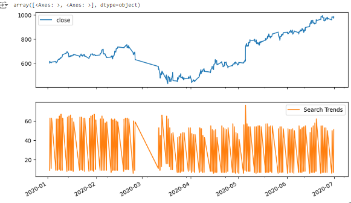
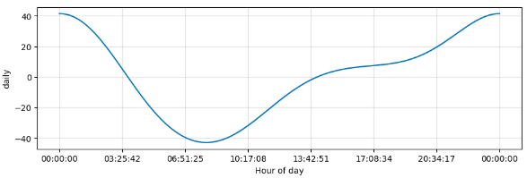
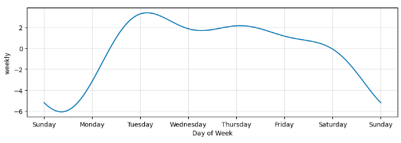
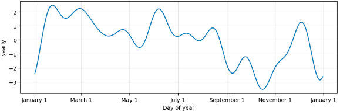

# Forecasting Net Prophet

**Case Study for MercadoLibre**

With over 200 million users, **MercadoLibre** is the most popular e-commerce site in Latin America. This project analyzes the company's financial and user data to explore potential growth strategies by leveraging search traffic data to predict stock trading outcomes.

**[Data](#data)** | **[Data Processing](#data-processing)** | **[Exploratory Data Analysis (EDA)](#exploratory-data-analysis-eda)** | **[Technologies and Tools](#core-skills-technologies-tools)** | **[Continued Exploration](#continued-exploration)**

## Abstract

**Forecasting Net Prophet** sets out to determine if patterns in Google search traffic for MercadoLibre can be leveraged to predict the company stock price trends.  Analysis includes identifying unusual search traffic patterns, mining data for seasonality trends, correlating search traffic to stock price patterns, and using **Prophet** for time-series modeling.

Prophet is an open-source, time-series forecasting tool developed by **Facebook** (now Meta), designed to handle daily, weekly, and yearly seasonality

The analysis includes multiple time periods such as daily, weekly, and seasonal data to find correlations that could be leveraged to optimize business strategies and improve stock trading decisions.

## Data

The data in this project comes from the following sources:

1. **Google Hourly Search Trends** : hourly search traffic for MercadoLibre [[Source](https://static.bc-edx.com/ai/ail-v-1-0/m8/lms/datasets/google_hourly_search_trends.csv)]
2. **MercadoLibre Stock Prices** : stock price information for the company over time [[Source](https://static.bc-edx.com/ai/ail-v-1-0/m8/lms/datasets/mercado_stock_price.csv)]

### Data Processing

Cleaning, transforming, and preparing raw data for analysis, focusing on correlating search trends with stock price patterns.

* **Data Extraction and Preprocessing** : data extracted from CSV files related to MercadoLibre's stock and Google search traffic, followed by data formatting and standardization using Pandas.
* **Time-Series Transformation** : Prepared time-series data with proper datetime indexing.
* **Merging** : Google search data for MercadoLibre merged with MercadoLibre stock price data for joint analysis.
* **Data Cleaning** : Removed outliers and filled in missing data using interpolation methods to ensure data consistency.

### Exploratory Data Analysis (EDA)

The **Exploratory Data Analysis** section aimed to:

* **Identify Unusual Search Traffic Patterns** : Investigated whether significant events at MercadoLibre were reflected in search traffic spikes.
* **Seasonality Analysis** : Analyzed search data to find daily, weekly, and yearly seasonal patterns, aiming to determine the most popular times for searches.
* **Correlation with Stock Price** : Explored correlations between search traffic and MercadoLibre's stock price, identifying potential relationships that indicate market behavior.

### Results

Analysis revealed several key insights regarding MercadoLibre's Google search traffic and its stock price trends:

* **Unusual Patterns in Search Traffic** : Google search traffic for MercadoLibre increased significantly during May 2020, with searches totaling  **38,181** , higher than the monthly median of  **35,172** . This spike coincides with the company's release of financial resultsality Analysis**:
* **Correlation with Stock Price** : There were drastic drop in both search trends and stock price in late February 2020- mid-March 2020.  This coincided with the beginning of the global Covid pandemic.  Search trends showed a steady increase thereafter, with stock prices returning to pre-event levels and remaining steady.

	

	<em>MercadoLibre Search Trends and Correlation with Stock Price, 2020</em>
 

* **Hourly Trends** : Search traffic showed decline after start of the day, hitting lowest point around 8th hour, then ramping up from 15th - 24th hour.  Peak activity occurred towards the end of the day .
* **Daily activity :** started high on Mondays, peaked on Tuesdays, and gradually declined through the week, with significant drops on weekends.
* **Yearly Trends** : Lowest during late December - early January, likely due to the holiday period, and showed spikes during late January and other periods coinciding with major holidays .

	 
	<em>MercadoLibre Search Traffic, Hourly Trends</em>

	
 
	<em>MercadoLibre Search Traffic, Day of Week Trends</em>

	
 
	<em>MercadoLibre Search Traffic, Day of Year Trends</em>

### Technologies and Tools

* **Tools and Libraries** : Python, Pandas, Prophet, and Jupyter Notebook for data analysis and time-series forecasting.
* ****Data Cleaning and Preparation** : Cleaned and merged search traffic and stock price datasets, ensuring consistency and reliability.**
* ****Time Series Forecasting** : Using the **Prophet** model, search traffic forecast predicted a potential dip in popularity over the next 80 days.**
* **Basic Statistical Analysis** : Leveraged Prophet to build a time-series model, including metrics like `yhat`, `yhat_lower`, and `yhat_upper` for forecast ranges.
* **Additional Time Series Components** : The analysis of individual time series revealed that the greatest search popularity occurred at midnight, and that Tuesday was the day with the most search activity .

### Continued Exploration

The next phase of the project could utilize **Large Language Models (LLMs)** and **Transformers** from Hugging Face to analyze the content of search trends and predict the sentiment of user interest over time. Additionally, fine-tuning models like **BERT** could provide more nuanced insights into user search behaviors and their connection to market trends.
